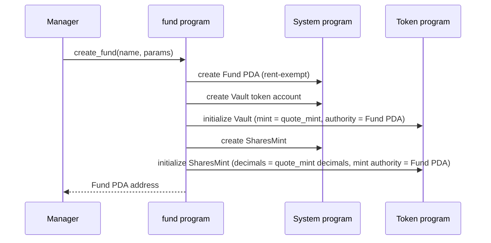
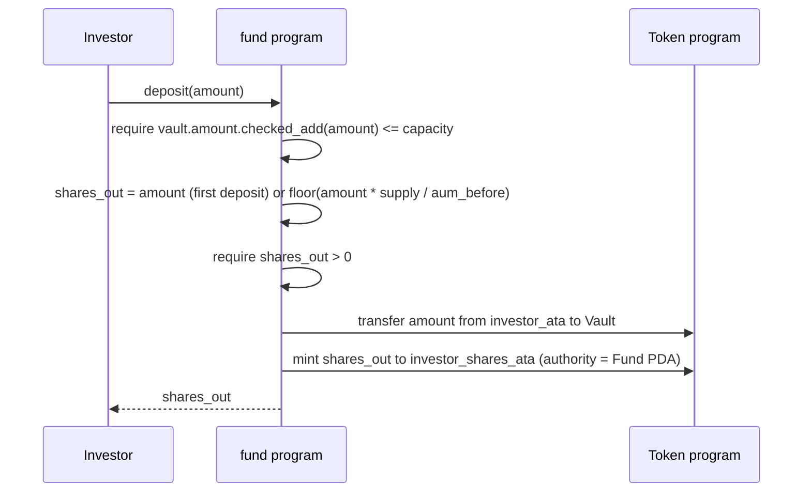

# `fund` — program specification

A `fund` is an on-chain managed investment vehicle. Investors deposit a
single quote currency (which is always intended to be a stablecoin —
typically USDC) into the fund's vault and receive fund-shares in
return. Shares are a fungible pro-rata claim on the fund's holdings,
redeemable for quote currency at a later point.

This document grows feature-by-feature. **Currently specified:** fund
creation and deposits. Withdrawals, fees, and off-vault positions live
under "Not yet specified" at the bottom and will be expanded when we
implement them.

> **Status:** `create_fund` and `deposit` are specification targets for
> the upcoming implementation — neither is deployed yet. The program's
> only exported entrypoint today is the scaffold `initialize`.

## Concepts

- **Fund** — the top-level on-chain account. Holds the parameters set
  at creation and the bumps needed to derive its child PDAs.
- **Quote mint** — SPL token mint that investors deposit, e.g. the USDC
  mint. Always a stablecoin in practice. A fund has exactly one quote
  mint, fixed at creation.
- **Vault** — SPL token account in the quote mint, owned (authority) by
  the Fund PDA. The only place quote currency lives in v0.
- **Shares mint** — SPL token mint owned by the Fund PDA. The supply of
  shares represents 100% of the fund's claim on the vault.
- **AUM** — assets under management. For now, AUM is exactly the
  vault's quote-token balance. (Off-vault positions are out of scope
  until we add them.)
- **Share price** — `AUM / total_shares`, expressed in quote per share.
  By design, on the **first deposit** share price is exactly `1` quote
  per share (i.e. the depositor receives `deposit_amount` shares). This
  is well-defined because the quote currency is a stablecoin — there is
  no meaningful "starting NAV" to anchor against other than 1:1.

## Fund parameters (set at creation, immutable in v0)

| field | type | description |
|---|---|---|
| `manager` | `Pubkey` | signer authorized to create the fund; future versions also let the manager update parameters and collect fees |
| `quote_mint` | `Pubkey` | SPL mint of the quote currency (must be a stablecoin) |
| `management_fee_bps` | `u16` | annualized management fee, basis points (1 bp = 0.01%). Recorded but not yet charged. |
| `performance_fee_bps` | `u16` | performance fee on gains, basis points. Recorded but not yet charged. |
| `capacity` | `u64` | hard cap on AUM, in quote-currency base units. Deposits that would push the vault above `capacity` fail. |
| `withdrawal_delay_seconds` | `i64` | required wait between signaling a withdrawal and claiming it. Recorded for the contract surface; the withdraw instructions themselves are not in v0. Stored in seconds so it composes with `Clock::unix_timestamp` directly. |

## Accounts derived from the Fund

| account | seeds | owner |
|---|---|---|
| `Fund` | `[b"fund", manager, name]` | program |
| `Vault` (SPL token account) | `[b"vault", fund.key()]` | SPL Token program; authority = Fund PDA |
| `SharesMint` (SPL mint) | `[b"shares", fund.key()]` | SPL Token program; mint authority = Fund PDA |

`name` is a short byte slice supplied by the manager so one manager
can create multiple funds without seed collision.

## Instructions

### `create_fund`

Manager creates a fund with its parameters. Allocates the `Fund` PDA, a
`Vault` SPL token account, and a `SharesMint`. The shares mint's
decimals match the quote mint's, so on-chain share amounts read in the
same units as quote balances.

**Inputs**
- `name: [u8; N]` — small byte slice, part of the Fund PDA seeds.
- `params: FundParams` — the table above.

**Accounts**
- `manager` — `Signer`, pays rent.
- `fund` — `init` PDA.
- `vault` — `init` SPL token account at the derived PDA.
- `shares_mint` — `init` SPL mint at the derived PDA.
- `quote_mint` — the SPL mint referenced by `params.quote_mint`,
  read-only.
- system program, token program, rent sysvar.

**Error conditions**
- `FundAlreadyExists` — a `Fund` PDA already exists for
  `(manager, name)`; Anchor's `init` rejects re-initialization.
- `InvalidFundPdaSeed` / `InvalidVaultSeed` / `InvalidSharesMintSeed` —
  a passed account does not match its derived PDA
  (`[b"fund", manager, name]`, `[b"vault", fund.key()]`,
  `[b"shares", fund.key()]`).
- `QuoteMintMismatch` — the `quote_mint` account does not match
  `params.quote_mint`, or is not a valid SPL mint.
- `RentExemptCreationFailed` — the manager cannot fund rent-exempt
  creation of the `Fund`, `Vault`, or `SharesMint` accounts.
- Any remaining Anchor constraint failure (missing signer, wrong
  ownership, wrong token program) aborts before state is written.

### `deposit`

Investor moves `amount` quote tokens from their own ATA into the
vault, and receives freshly-minted shares.

**Share math:**
- If `shares_mint.supply == 0` (first deposit): investor receives
  `amount` shares. The stablecoin assumption makes this 1:1 mapping
  meaningful as the anchor for share price.
- Otherwise: investor receives
  `shares_out = amount * shares_mint.supply / vault.amount`, where
  `vault.amount` is read **before** the inbound transfer and the
  division is **floor** integer division (rounds down, in the fund's
  favor).
- If the floored `shares_out == 0`, the deposit fails (`ZeroSharesOut`)
  — a dust deposit must never transfer quote tokens without minting
  shares, silently donating value to existing holders.

Capacity is enforced with overflow-safe addition: the deposit fails if
`vault.amount.checked_add(amount)` is `None` (`ArithmeticOverflow`) or
the resulting sum exceeds `capacity` (`CapacityExceeded`).

**Inputs**
- `amount: u64` — quote-token base units to deposit.

**Accounts**
- `investor` — `Signer`.
- `fund` — Fund PDA, read-only.
- `vault` — Fund's vault, `mut`.
- `shares_mint` — Fund's shares mint, `mut`.
- `investor_quote_ata` — investor's quote-token ATA, `mut`.
- `investor_shares_ata` — investor's shares ATA, `mut` (`init_if_needed`).
- token program, associated-token program, system program.

**Error conditions**
- `ArithmeticOverflow` — `vault.amount.checked_add(amount)` is `None`.
- `CapacityExceeded` — `vault.amount + amount` exceeds `capacity`
  (checked before the inbound transfer).
- `ZeroSharesOut` — the floored share math yields `shares_out == 0`.
- `InsufficientFunds` — `investor_quote_ata` holds fewer than `amount`
  quote tokens; the SPL transfer fails.
- `VaultAuthorityMismatch` / `SharesMintMismatch` — the passed `vault`
  or `shares_mint` is not the Fund PDA's derived account
  (`[b"vault", fund.key()]` / `[b"shares", fund.key()]`) or its
  authority is not the Fund PDA.
- `InvestorAtaMismatch` — `investor_quote_ata` is not the investor's
  ATA for `quote_mint`, or `investor_shares_ata` is not the investor's
  ATA for `shares_mint`.
- Any remaining Anchor constraint failure (missing signer, wrong
  ownership, wrong token program) aborts before state is written.

Ordering precondition: `vault.amount` is read and both checks
(capacity, `shares_out > 0`) pass **before** the inbound transfer, so a
failed deposit can never leave investor tokens in the vault.

## Not yet specified

Each of these will get its own section with a sequence diagram before
it is implemented. They are listed here only so the on-chain account
layout (which records the parameters) doesn't drift from the eventual
behavior.

- Withdrawals — both signaling and claiming, with the
  `withdrawal_delay_seconds` enforced.
- Management fee accrual.
- Performance fee accrual (incl. high-water-mark).
- Manager fee collection instructions.
- Off-vault positions and the corresponding AUM accounting.
- Updating fund parameters after creation.
