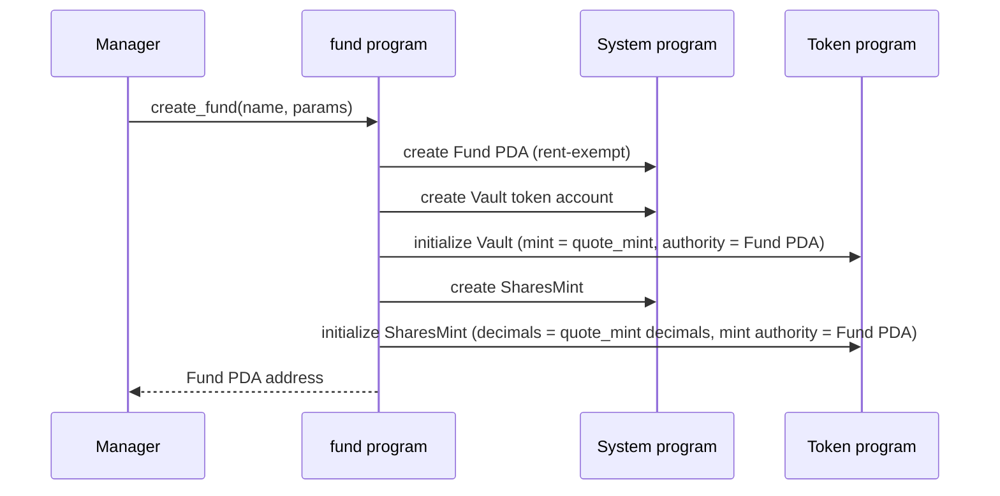
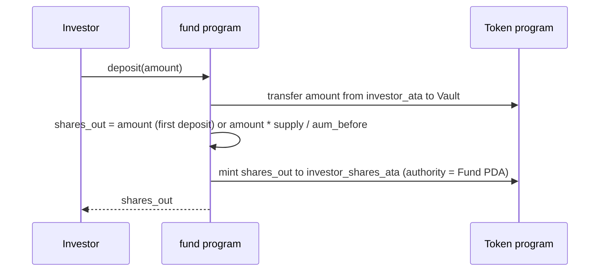
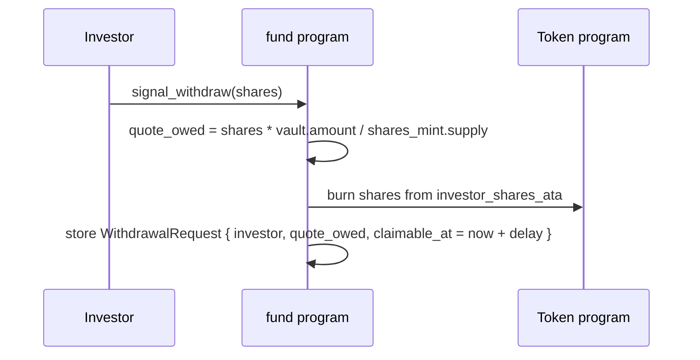
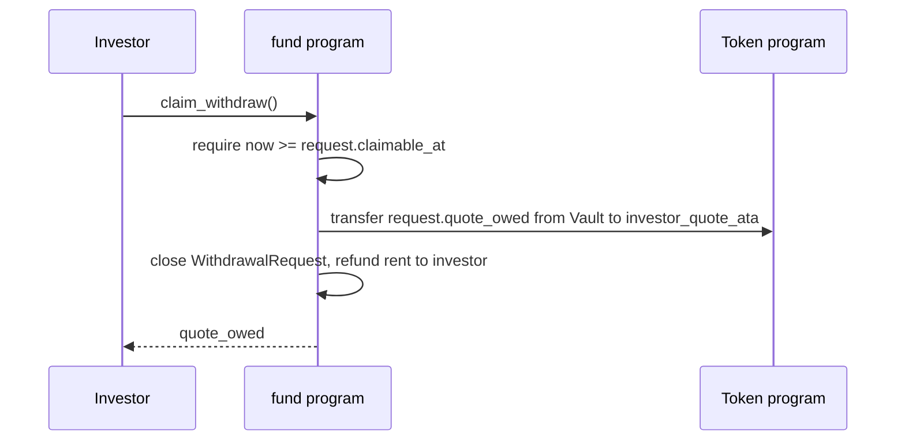

# `fund` — program specification

A `fund` is an on-chain managed investment vehicle. Investors deposit a
single quote currency (typically USDC) into the fund's vault and receive
fund-shares in return, redeemable for a pro-rata claim on the fund's
assets. The manager is the signer authorized to create the fund, set
parameters, and (later) collect fees.

This spec covers **v0**: fund creation, deposits, and withdrawals with a
notice period. Fee accrual, off-vault positions, and AUM accounting
beyond the vault balance are out of scope and called out at the bottom.

## Concepts

- **Fund** — the top-level on-chain account. Holds the parameters set at
  creation and the bumps needed to derive its child PDAs.
- **Quote mint** — SPL token mint that investors deposit and withdraw,
  e.g. USDC. A fund has exactly one quote mint, fixed at creation.
- **Vault** — SPL token account in the quote mint, owned (authority) by
  the Fund PDA. The only place quote currency lives.
- **Shares mint** — SPL token mint owned by the Fund PDA. The supply of
  shares represents 100% of the fund's claim. A share is a fungible
  pro-rata claim on the vault.
- **AUM** — assets under management. For v0, AUM is exactly the vault's
  quote-token balance. (Future versions will add off-vault positions.)
- **Share price** — `AUM / total_shares`, expressed in quote per share.
  On the first deposit, share price is defined as `1` quote per share
  (i.e. the depositor receives `deposit_amount` shares).
- **WithdrawalRequest** — per-investor PDA recording an in-flight
  withdrawal that has been signaled but not yet claimed.

## Fund parameters (set at creation, immutable in v0)

| field | type | description |
|---|---|---|
| `manager` | `Pubkey` | signer authorized to create the fund; future versions also let the manager update parameters and collect fees |
| `quote_mint` | `Pubkey` | SPL mint of the quote currency (e.g. the USDC mint) |
| `management_fee_bps` | `u16` | annualized management fee in basis points (1 bp = 0.01%). Not accrued in v0; recorded so the on-chain account has the full contract. |
| `performance_fee_bps` | `u16` | performance fee on gains, basis points. Not accrued in v0. |
| `capacity` | `u64` | hard cap on AUM, in quote-currency base units. Deposits that would push the vault above `capacity` fail. |
| `withdrawal_delay_seconds` | `i64` | required time between a `signal_withdraw` and the matching `claim_withdraw`. Stored in seconds rather than days so it composes with `Clock::unix_timestamp` directly. |

## Accounts derived from the Fund

All PDAs are derived from the Fund's address so each fund owns its own
isolated vault / shares mint / per-investor request accounts.

| account | seeds | owner |
|---|---|---|
| `Fund` | `[b"fund", manager, name]` | program |
| `Vault` (SPL token account) | `[b"vault", fund.key()]` | SPL Token program; authority = Fund PDA |
| `SharesMint` (SPL mint) | `[b"shares", fund.key()]` | SPL Token program; mint authority = Fund PDA |
| `WithdrawalRequest` | `[b"withdraw", fund.key(), investor.key()]` | program |

`name` (a short byte slice supplied by the manager) lets one manager
create multiple funds without collision.

## Instructions

### `create_fund`

Manager creates a fund with its parameters. Allocates the `Fund` PDA, a
`Vault` SPL token account owned by the Fund PDA, and a `SharesMint` SPL
mint owned by the Fund PDA.



**Inputs**
- `name: [u8; N]` — small byte slice, part of the Fund PDA seeds.
- `params: FundParams` — the table in the previous section.

**Accounts**
- `manager` — `Signer`, pays rent.
- `fund` — `init` PDA.
- `vault` — `init` SPL token account at the derived PDA.
- `shares_mint` — `init` SPL mint at the derived PDA.
- `quote_mint` — the SPL mint referenced by `params.quote_mint`. Read-only.
- system program, token program, rent sysvar.

### `deposit`

Investor moves `amount` quote tokens from their own ATA into the
vault, and receives freshly-minted shares.

**Share math (v0):**
- If `shares_mint.supply == 0`: investor receives `amount` shares
  (defines share price = 1).
- Otherwise: investor receives
  `amount * shares_mint.supply / vault.amount`, where `vault.amount` is
  read **before** the inbound transfer.

Deposit fails if `vault.amount + amount > capacity`.



**Inputs**
- `amount: u64` — quote-token base units to deposit.

**Accounts**
- `investor` — `Signer`.
- `fund` — Fund PDA, read-only.
- `vault` — Fund's vault, `mut`.
- `shares_mint` — Fund's shares mint, `mut`.
- `investor_quote_ata` — investor's quote-token ATA, `mut`.
- `investor_shares_ata` — investor's shares ATA, `mut` (`init_if_needed`).
- token program, ATA program, system program.

### `signal_withdraw`

Investor declares the intent to redeem `shares` shares. Burns the shares
from the investor's account now and records the pending payout in a
`WithdrawalRequest` PDA, which becomes claimable after
`withdrawal_delay_seconds`. Burning at signal time (rather than at
claim) freezes the share price for that request — subsequent deposits or
withdrawals don't change what this investor will receive.

The quote-token payout is computed at signal time as
`quote_owed = shares * vault.amount / shares_mint.supply`, evaluated
**before** the burn.



**Inputs**
- `shares: u64` — number of shares to burn now and redeem later.

**Accounts**
- `investor` — `Signer`.
- `fund` — Fund PDA, read-only.
- `vault` — Fund's vault, read-only (used only to compute share price).
- `shares_mint` — Fund's shares mint, `mut` (supply decreases on burn).
- `investor_shares_ata` — `mut`.
- `withdrawal_request` — `init` PDA seeded by `(fund, investor)`. V0
  allows at most one outstanding request per `(fund, investor)`.
- token program, system program, clock sysvar.

### `claim_withdraw`

After the delay has elapsed, the investor exchanges their
`WithdrawalRequest` for the quote tokens recorded at signal time. The
request account is closed and rent refunded.



**Inputs** — none.

**Accounts**
- `investor` — `Signer`.
- `fund` — Fund PDA, read-only.
- `vault` — Fund's vault, `mut`.
- `investor_quote_ata` — `mut`.
- `withdrawal_request` — `mut, close = investor`.
- token program, clock sysvar.

## Round-trip invariant (v0)

For a single investor with no other deposits, no time-weighted fees, and
no value change in the vault:

```
deposit(X) → receive X shares
signal_withdraw(X) → request.quote_owed = X
…wait withdrawal_delay_seconds…
claim_withdraw() → receive X quote
```

The first integration test exercises exactly this round-trip with the
SVM clock advanced past `claimable_at`.

## Out of scope for v0

- Management fee accrual (recorded but not charged).
- Performance fee accrual (recorded but not charged).
- Off-vault positions (the fund can only hold the quote currency).
- High-water-mark tracking for performance fees.
- Updating fund parameters after creation.
- Manager fee withdrawal instructions.
- Multiple outstanding `WithdrawalRequest`s per `(fund, investor)`.
- Slippage / partial fills on withdrawal when the vault is below
  `quote_owed` (v0 assumes a fully-liquid vault; the transfer simply
  fails if the balance is short).
