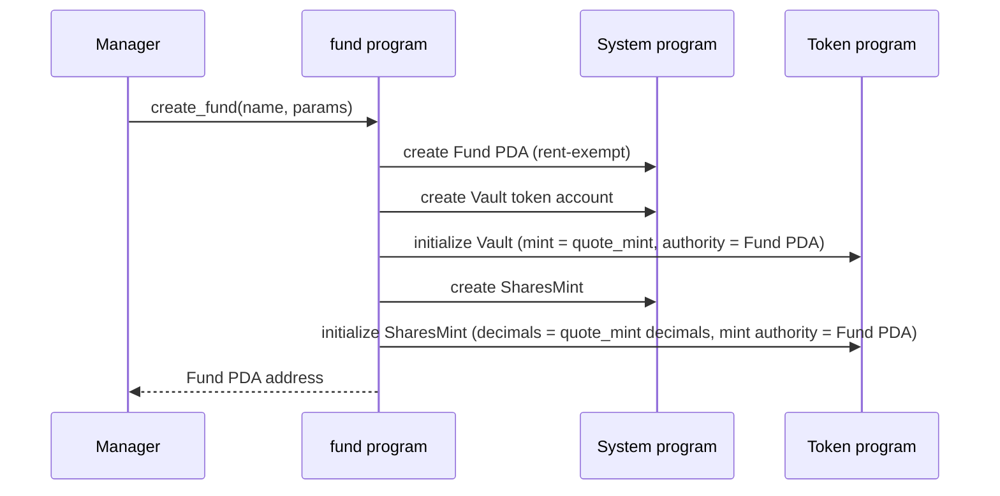

# `fund` — program specification

A `fund` is an on-chain managed investment vehicle. Investors deposit a
single quote currency (always intended to be a stablecoin — typically
USDC) into the fund's vault and receive fund-shares in return. Shares
are a fungible pro-rata claim on the fund's holdings, redeemable for
quote currency at a later point.

This document grows feature-by-feature. **Currently specified:** fund
creation. Everything else lives under "Not yet specified" at the bottom
and will be expanded when we implement it.

## Concepts

- **Fund** — the top-level on-chain account. Holds the parameters set
  at creation and the bumps needed to derive its child PDAs.
- **Manager** — signer authorized to create the fund. Future features
  will let the manager update parameters and collect fees.
- **Quote mint** — SPL token mint that investors will eventually
  deposit, e.g. the USDC mint. Always a stablecoin in practice. A fund
  has exactly one quote mint, fixed at creation.
- **Vault** — SPL token account in the quote mint, owned (authority)
  by the Fund PDA. Created at fund creation; no balance flows in or
  out until deposits and withdrawals exist.
- **Shares mint** — SPL token mint owned by the Fund PDA. Created
  with zero supply at fund creation. Will be minted on deposit and
  burned on withdrawal in subsequent features.

## Fund parameters (set at creation, immutable in v0)

| field | type | description |
|---|---|---|
| `manager` | `Pubkey` | signer authorized to create the fund. Stored on the Fund account so future fee-collection and admin instructions can gate on it. |
| `quote_mint` | `Pubkey` | SPL mint of the quote currency. Must be a stablecoin. |
| `management_fee_bps` | `u16` | annualized management fee, basis points (1 bp = 0.01%). Recorded now; accrual is a later feature. |
| `performance_fee_bps` | `u16` | performance fee on gains, basis points. Recorded now; accrual is a later feature. |
| `capacity` | `u64` | hard cap on AUM, in quote-currency base units. Will be enforced by `deposit` once that instruction exists. |
| `withdrawal_delay_days` | `u16` | required wait between signaling a withdrawal and claiming it. Recorded now; enforcement is a later feature. The on-chain check (when it exists) will convert to seconds against `Clock::unix_timestamp`. |

## Accounts created

| account | seeds | owner |
|---|---|---|
| `Fund` | `[b"fund", manager, name]` | program |
| `Vault` (SPL token account) | `[b"vault", fund.key()]` | SPL Token program; authority = Fund PDA |
| `SharesMint` (SPL mint) | `[b"shares", fund.key()]` | SPL Token program; mint authority = Fund PDA |

`name` is a short byte slice supplied by the manager so one manager can
create multiple funds without seed collision.

## Instructions

### `create_fund`

Manager creates a fund with its parameters. Allocates the `Fund` PDA, a
`Vault` SPL token account, and a `SharesMint`. The shares mint's
decimals match the quote mint's, so on-chain share amounts read in the
same units as quote balances.

**Inputs**
- `name: [u8; N]` — small byte slice, part of the Fund PDA seeds.
- `params: FundParams` — the table above (excluding `manager`, which is
  read from the signer).

**Accounts**
- `manager` — `Signer`, pays rent.
- `fund` — `init` PDA at the seeds above.
- `vault` — `init` SPL token account at the derived PDA.
- `shares_mint` — `init` SPL mint at the derived PDA.
- `quote_mint` — the SPL mint referenced by `params.quote_mint`,
  read-only.
- system program, token program, rent sysvar.

**Effects**
- `Fund` account is initialized with the supplied parameters and the
  PDA bumps needed to re-derive `Vault` / `SharesMint` cheaply.
- `Vault` is a fresh quote-mint token account with balance 0, authority
  set to the Fund PDA.
- `SharesMint` is a fresh SPL mint with supply 0, mint authority set to
  the Fund PDA, decimals matching `quote_mint`.

## Not yet specified

Each of these will get its own section with a sequence diagram before
it is implemented. Listed here only so the parameters recorded at fund
creation don't drift from the eventual behavior.

- Deposits.
- Withdrawals — signaling and claiming, with the
  `withdrawal_delay_days` enforced.
- Management fee accrual.
- Performance fee accrual (incl. high-water-mark).
- Manager fee collection instructions.
- Off-vault positions and the corresponding AUM accounting.
- Updating fund parameters after creation.
