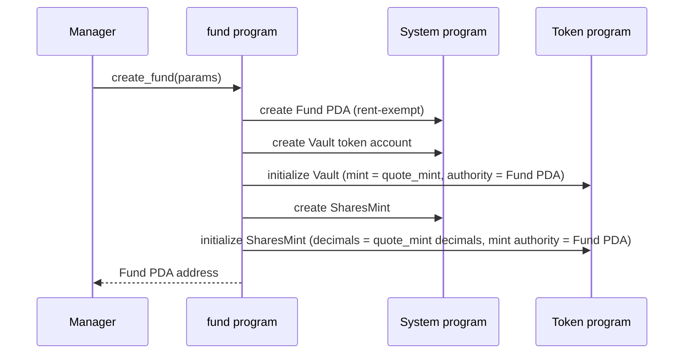
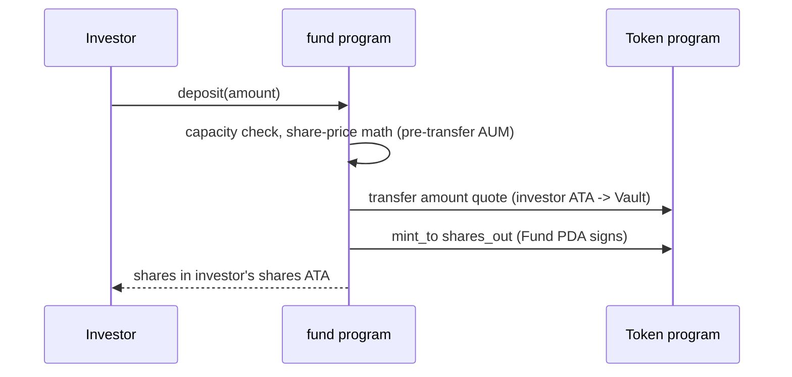

# `fund` -- program specification

A `fund` is an on-chain managed investment vehicle. Investors deposit a single
quote currency (typically a stablecoin such as USD Coin (USDC) -- not enforced
on-chain) into the fund's vault and receive fund-shares in return. Shares are a
fungible pro-rata claim on the fund's holdings, redeemable for quote currency at
a later point.

This document grows feature-by-feature. **Currently specified:** fund creation
and deposit. Everything else lives under "Not yet specified" at the bottom and
will be expanded when we implement it.

## Concepts

- **Fund** -- the top-level on-chain account. Holds the parameters set at
  creation, the `name` seed, and the bumps needed to re-derive itself and its
  child Program Derived Addresses (PDAs). The Fund's own bump is stored because
  the Fund PDA is the Vault / SharesMint authority -- later instructions must
  re-derive its seeds on-chain to sign Cross-Program Invocations (CPIs). It also
  carries `total_assets`: the running internal accounting of the fund's
  quote-denominated assets under management (initialized to 0, raised on
  `deposit`, lowered on withdrawal), which is the donation-resistant basis for
  share pricing -- the share price reads `total_assets`, never `vault.amount`
  (see the deposit Share math).
- **Manager** -- signer authorized to create the fund. Future features will let
  the manager update parameters and collect fees.
- **Quote mint** -- SPL (Solana Program Library) token mint that investors will
  eventually deposit. Typically a stablecoin such as USDC -- not enforced
  on-chain. A fund has exactly one quote mint, fixed at creation.
- **Vault** -- SPL token account in the quote mint, owned (authority) by the
  Fund PDA. Created at fund creation; quote enters on `deposit` and will exit on
  withdrawal (not yet specified).
- **Shares mint** -- SPL token mint owned by the Fund PDA. Created with zero
  supply at fund creation. Minted on `deposit`; burned on withdrawal in a
  subsequent feature.

## Fund parameters (set at creation, immutable in v0)

| field                   | type       | description                                                                                                                                                                                              |
| ----------------------- | ---------- | -------------------------------------------------------------------------------------------------------------------------------------------------------------------------------------------------------- |
| `manager`               | `Pubkey`   | signer authorized to create the fund. Stored on the Fund account so future fee-collection and admin instructions can gate on it.                                                                         |
| `name`                  | `[u8; 32]` | fund name, part of the Fund PDA seeds. Stored so later instructions can re-derive the Fund PDA's seeds on-chain.                                                                                         |
| `quote_mint`            | `Pubkey`   | SPL mint of the quote currency, copied from the validated `quote_mint` account -- not supplied in `params`. Typically a stablecoin such as USDC; not enforced on-chain.                                  |
| `management_fee_bps`    | `u16`      | annualized management fee, basis points (1 bp = 0.01%). Recorded now; accrual is a later feature.                                                                                                        |
| `performance_fee_bps`   | `u16`      | performance fee on gains, basis points. Recorded now; accrual is a later feature.                                                                                                                        |
| `capacity`              | `u64`      | hard cap on assets under management (AUM), in quote-currency base units, enforced on every `deposit`: the deposit is rejected (`CapacityExceeded`) when `total_assets + amount` would exceed it.         |
| `withdrawal_delay_days` | `u16`      | required wait between signaling a withdrawal and claiming it. Recorded now; enforcement is a later feature. The on-chain check (when it exists) will convert to seconds against `Clock::unix_timestamp`. |

**Design rationale.** `management_fee_bps`, `performance_fee_bps`, `capacity`,
and `withdrawal_delay_days` are recorded immutably at creation even though the
features that consume them arrive later. The fund's terms are part of its
on-chain identity from day one: limited partners (LPs) can rely on the terms
they joined under, and a manager cannot quietly raise fees or lockups after
money is in (anti-rug). In v0 every parameter is immutable; enforcement of each
lands with the corresponding deposit / withdrawal / fee feature. Parameter
updates after creation stay under "Not yet specified".

## Accounts created

| account                     | seeds                      | owner                                        |
| --------------------------- | -------------------------- | -------------------------------------------- |
| `Fund`                      | `[b"fund", manager, name]` | program                                      |
| `Vault` (SPL token account) | `[b"vault", fund.key()]`   | SPL Token program; authority = Fund PDA      |
| `SharesMint` (SPL mint)     | `[b"shares", fund.key()]`  | SPL Token program; mint authority = Fund PDA |

`name` is a short byte slice supplied by the manager so one manager can create
multiple funds without seed collision.

## Instructions

### `create_fund`

Manager creates a fund with its parameters. Allocates the `Fund` PDA, a `Vault`
SPL token account, and a `SharesMint`. The shares mint's decimals match the
quote mint's, so on-chain share amounts read in the same units as quote
balances. This equality holds under the chosen donation-resistant pricing:
`adrs/0001-donation-resistant-share-pricing.md` left the virtual-share offset to
this SPEC, and the deposit section fixes it at offset 0 (`V_SHARES = 1`), so one
quote unit mints one share unit at par and no decimals bump is needed.

**Inputs**

- `params: CreateFundParams` -- the table above, excluding `manager` (read from
  the signer) and `quote_mint` (read from the `quote_mint` account). `name` is
  supplied here as a fixed-size `[u8; 32]`, part of the Fund PDA seeds: shorter
  human-readable names are padded with trailing zero bytes, and the padding must
  be canonical (no non-zero byte after the first zero). Canonical padding
  prevents visually-identical names (e.g. `foo` vs `foo\0\x01`) from mapping to
  distinct PDAs, which could confuse users or frontends (collision/confusion
  attacks).

**Accounts**

- `manager` -- `Signer`, pays rent.
- `fund` -- `init` PDA at the seeds above.
- `vault` -- `init` SPL token account at the derived PDA.
- `shares_mint` -- `init` SPL mint at the derived PDA.
- `quote_mint` -- the SPL mint the vault will hold, read-only. Its key is copied
  into the Fund state. The program deliberately does NOT reject mints with an
  active `freeze_authority`: the intended quote currency (USDC) has one, so a
  freeze-authority check would block the primary use case. The residual risk is
  accepted by design -- the mint's freeze authority (e.g. Circle for USDC) could
  freeze the vault token account, locking deposits until thawed; choosing a
  quote mint means accepting its issuer as a counterparty.
- system program, token program.

**Effects**

- `Fund` account is initialized with `name`, the supplied parameters, the
  `quote_mint` key, all three PDA bumps (`fund_bump`, `vault_bump`,
  `shares_mint_bump`), and `total_assets = 0` (no quote is accounted until the
  first deposit). The child bumps re-derive `Vault` / `SharesMint` cheaply; the
  Fund's own bump lets later instructions validate and sign as the Fund PDA via
  `seeds = [b"fund",
  fund.manager.as_ref(), fund.name.as_ref()], bump = fund.fund_bump`.
- `Vault` is a fresh quote-mint token account with balance 0, authority set to
  the Fund PDA.
- `SharesMint` is a fresh SPL mint with supply 0, mint authority set to the Fund
  PDA, decimals matching `quote_mint`.

**Error conditions**

- A `Fund` already exists for `(manager, name)` -- Anchor's `init` rejects
  re-initialization of the PDA.
- `management_fee_bps` exceeds `10_000` bps -- the implementation's
  `MAX_FEE_BPS` constant (100%), rejected with `ManagementFeeTooHigh`; a higher
  fee would let the manager extract more than the fund's entire value.
  `performance_fee_bps` above the same ceiling is rejected with
  `PerformanceFeeTooHigh` -- the two are distinct variants so a client can tell
  which fee was out of range.
- `name` is all zeros (empty) -- rejected with `EmptyName` ("name must be
  non-empty").
- `name` is not canonically zero-padded (a non-zero byte follows a zero) --
  rejected with `NonCanonicalName` ("name must be canonically zero-padded"). The
  two name failures are distinct variants for the same reason as the fees.
- `quote_mint` is not a valid SPL mint, or any account fails its declared
  constraints (signer, PDA seeds, ownership).

### `deposit`

An investor swaps `amount` quote tokens for freshly-minted shares: the quote
moves from the investor's Associated Token Account (ATA) into the `Vault`, then
the Fund PDA signs a `mint_to` of the computed shares into the investor's shares
ATA.

**Inputs**

- `amount: u64` -- quote tokens to deposit, in the quote mint's native units.
  Must be greater than zero.

**Accounts**

- `investor` -- `Signer`, pays rent for the shares ATA if it doesn't exist yet.
- `fund` -- the Fund PDA, validated via stored seeds + `fund_bump`, and `mut`
  because the deposit raises `total_assets` by `amount` after the share math.
  Safe because `Account<'info, Fund>` enforces the program-owner and 8-byte
  discriminator checks before the `seeds` constraint runs, so the stored
  `manager` / `name` fed into the seed re-derivation come from a genuine Fund
  account, not attacker-supplied bytes.
- `vault` -- the fund's quote token account, constrained to
  `seeds = [b"vault", fund.key()]`, `bump = fund.vault_bump`,
  `token::mint = fund.quote_mint`, and `token::authority = fund`. The PDA seeds
  pin it to the canonically-derived vault, not merely any token account the Fund
  PDA happens to own.
- `shares_mint` -- the fund's shares mint, constrained to
  `seeds = [b"shares", fund.key()]`, `bump = fund.shares_mint_bump`, and
  `mint::authority = fund`. The PDA seeds pin it to the canonically-derived
  shares mint.
- `investor_quote_ata` -- the investor's ATA for the quote mint; the deposit
  source. Constrained to the canonical ATA for `(investor,
  fund.quote_mint)`.
  Must already exist (it is **not** `init_if_needed`, unlike
  `investor_shares_ata`); an investor with no quote ATA must create it before
  depositing.
- `investor_shares_ata` -- the investor's ATA for the shares mint,
  `init_if_needed`. Safe despite the documented footgun: the associated-token
  constraints pin any pre-existing account to the canonical ATA for
  `(investor, shares_mint)`, so no foreign account can be substituted.
- token program, associated token program, system program.

**Evaluation order.** The handler checks `amount > 0` and capacity first, then
computes the share math, then performs the transfer and the `mint_to` (as in the
sequence diagram above). The subsections below are grouped by topic, not
execution order.

**Share math** (the executable contract;
`adrs/0001-donation-resistant-share-pricing.md` is the binding source for the
invariants, the formula, and the rounding direction -- this SPEC must not drift
from it)

Share price derives **solely from internal accounting** -- `fund.total_assets`
(the quote units the fund accounts as its own) and `shares_mint.supply` -- and
**never** from `vault.amount`. A direct token transfer into the Vault raises
`vault.amount` but not `total_assets`, so it cannot move the share price: that
is exactly what closes the classic ERC-4626 first-depositor inflation attack
(ERC-4626 is the Ethereum tokenized-vault standard), and a reproduction test
pins it.

**Virtual offset.** ADR 0001 fixes the formula but leaves the concrete
`(V_ASSETS, V_SHARES)` pair to this SPEC. We fix **`V_ASSETS = 1`,
`V_SHARES = 1`** (offset 0). Rationale: internal `total_assets` accounting is
the _complete_ donation defense (a donation never enters `total_assets`), so the
offset is not a second line of defense here -- its only remaining job is to keep
the first deposit's denominator non-zero, which `V_ASSETS = 1` achieves. We keep
`V_SHARES = 1` (offset 0, not `10^k`) so one quote unit still mints one share
unit at par: this preserves `create_fund`'s rule that the shares mint's decimals
equal the quote mint's (a nonzero offset would force a decimals bump for no
benefit), and keeps `capacity * V_SHARES <= u64::MAX` trivially satisfied. A
larger offset would matter only if the offset were the primary defense; it is
not.

**Formula.** `total_assets` and `supply` are read as they stand **before** this
deposit's accounting update; the product uses a `u128` intermediate
(`total_shares`/`total_assets` may approach `u64::MAX` near capacity) with a
checked narrowing back to `u64`:

- `shares_out = floor(amount * (supply + V_SHARES) / (total_assets + V_ASSETS))`

With `(V_ASSETS, V_SHARES) = (1, 1)`:

- First deposit (`supply == 0 && total_assets == 0`):
  `floor(amount * 1 / 1) == amount` -- minted 1:1, the same par as before. Quote
  donated into the vault beforehand does **not** enter `total_assets`, so it
  changes no price; it sits as unaccounted surplus (surplus handling is a
  separate decision, per ADR 0001).
- Subsequent deposits: pro-rata to `total_assets`, rounded **down** -- adverse
  to the depositor, in favor of the pool, so no rounding sequence extracts
  value.
- `shares_out == 0` is rejected (`ZeroShares`): a dust deposit may not take
  tokens for nothing. The existing guard survives the formula change, per
  ADR 0001.
- Overflow narrowing the `u128` quotient back to `u64` -- `MathOverflow`.

**Accounting update** (only after every guard above passes):
`total_assets += amount`, and the `mint_to` CPI raises `shares_mint.supply` by
`shares_out`. `Fund` keeps no redundant share-supply field -- the SPL mint is
the authoritative share counter.

**Accounting invariant.** `supply > 0 && total_assets == 0` is rejected
(`EmptyVaultWithShares`): shares outstanding against zero accounted assets is a
corruption of internal accounting, not a reachable pricing input, and with the
offset it would otherwise over-mint `amount * (supply + 1)` shares. Under
correct accounting `total_assets` and `supply` rise and fall together, so this
guards against a maintenance bug, not normal flow. (It is no longer about a
drained _vault_ -- `vault.amount` no longer drives pricing -- but the same error
variant carries the invariant.)

**Capacity**

- `total_assets + amount` must not exceed `fund.capacity` (overflow-checked:
  `MathOverflow` if the sum overflows `u64`, otherwise `CapacityExceeded` if it
  is in range but over the cap). The check reads `total_assets`, not
  `vault.amount`, so a direct donation cannot inflate the accounted AUM toward
  capacity and wrongly block legitimate deposits -- the same internal-accounting
  basis the share price uses.

**Error conditions**

- `amount == 0` -- `ZeroDeposit`.
- `total_assets + amount` overflows `u64` -- `MathOverflow` (the `checked_add`
  fails, so this precedes the capacity comparison).
- `total_assets + amount` is within `u64` but exceeds `fund.capacity` --
  `CapacityExceeded`.
- `supply > 0 && total_assets == 0` -- `EmptyVaultWithShares` (the accounting
  invariant in Share math above).
- `shares_out == 0` -- `ZeroShares`.
- Arithmetic overflow narrowing the share-math `u128` quotient to `u64` --
  `MathOverflow`.
- Insufficient quote balance in `investor_quote_ata` -- the SPL Token program
  rejects the `transfer` and the instruction fails with no state change.
- Any account failing its declared constraints (wrong ATA, wrong vault,
  non-signer investor).

## Not yet specified

Each of these will get its own section with a sequence diagram before it is
implemented. Listed here only so the parameters recorded at fund creation don't
drift from the eventual behavior.

- Withdrawals -- signaling and claiming, with the `withdrawal_delay_days`
  enforced.
- Management fee accrual.
- Performance fee accrual (incl. high-water-mark).
- Manager fee collection instructions.
- Off-vault positions and the corresponding AUM accounting.
- Updating fund parameters after creation.
