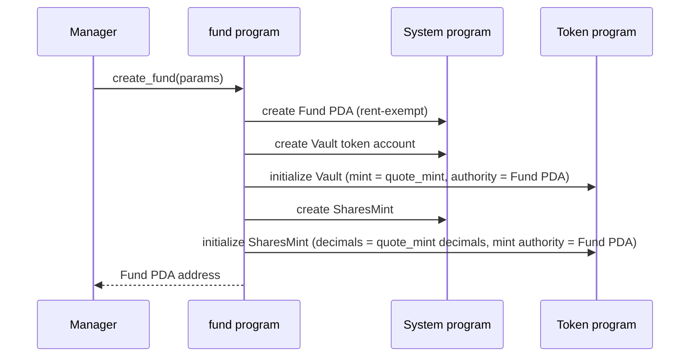
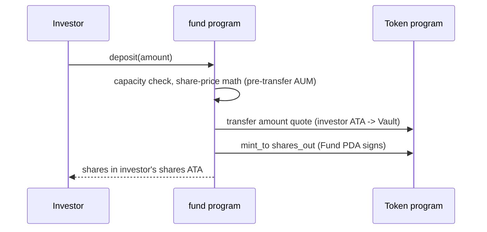

# `fund` — program specification

A `fund` is an on-chain managed investment vehicle. Investors deposit a
single quote currency (typically a stablecoin such as USDC — not
enforced on-chain) into the fund's vault and receive fund-shares in
return. Shares are a fungible pro-rata claim on the fund's holdings,
redeemable for quote currency at a later point.

This document grows feature-by-feature. **Currently specified:** fund
creation and deposit. Everything else lives under "Not yet specified" at
the bottom and will be expanded when we implement it.

## Concepts

- **Fund** — the top-level on-chain account. Holds the parameters set
  at creation, the `name` seed, and the bumps needed to re-derive
  itself and its child PDAs. The Fund's own bump is stored because the
  Fund PDA is the Vault / SharesMint authority — later instructions
  must re-derive its seeds on-chain to sign CPIs.
- **Manager** — signer authorized to create the fund. Future features
  will let the manager update parameters and collect fees.
- **Quote mint** — SPL token mint that investors will eventually
  deposit. Typically a stablecoin such as USDC — not enforced
  on-chain. A fund has exactly one quote mint, fixed at creation.
- **Vault** — SPL token account in the quote mint, owned (authority)
  by the Fund PDA. Created at fund creation; quote enters on `deposit`
  and will exit on withdrawal (not yet specified).
- **Shares mint** — SPL token mint owned by the Fund PDA. Created
  with zero supply at fund creation. Minted on `deposit`; burned on
  withdrawal in a subsequent feature.

## Fund parameters (set at creation, immutable in v0)

| field | type | description |
|---|---|---|
| `manager` | `Pubkey` | signer authorized to create the fund. Stored on the Fund account so future fee-collection and admin instructions can gate on it. |
| `name` | `[u8; 32]` | fund name, part of the Fund PDA seeds. Stored so later instructions can re-derive the Fund PDA's seeds on-chain. |
| `quote_mint` | `Pubkey` | SPL mint of the quote currency, copied from the validated `quote_mint` account — not supplied in `params`. Typically a stablecoin such as USDC; not enforced on-chain. |
| `management_fee_bps` | `u16` | annualized management fee, basis points (1 bp = 0.01%). Recorded now; accrual is a later feature. |
| `performance_fee_bps` | `u16` | performance fee on gains, basis points. Recorded now; accrual is a later feature. |
| `capacity` | `u64` | hard cap on AUM, in quote-currency base units, enforced on every `deposit`: the deposit is rejected (`CapacityExceeded`) when `aum_before + amount` would exceed it. |
| `withdrawal_delay_days` | `u16` | required wait between signaling a withdrawal and claiming it. Recorded now; enforcement is a later feature. The on-chain check (when it exists) will convert to seconds against `Clock::unix_timestamp`. |

**Design rationale.** `management_fee_bps`, `performance_fee_bps`,
`capacity`, and `withdrawal_delay_days` are recorded immutably at
creation even though the features that consume them arrive later. The
fund's terms are part of its on-chain identity from day one: LPs can
rely on the terms they joined under, and a manager cannot quietly raise
fees or lockups after money is in (anti-rug). In v0 every parameter is
immutable; enforcement of each lands with the corresponding deposit /
withdrawal / fee feature. Parameter updates after creation stay under
"Not yet specified".

## Accounts created

| account | seeds | owner |
|---|---|---|
| `Fund` | `[b"fund", manager, name]` | program |
| `Vault` (SPL token account) | `[b"vault", fund.key()]` | SPL Token program; authority = Fund PDA |
| `SharesMint` (SPL mint) | `[b"shares", fund.key()]` | SPL Token program; mint authority = Fund PDA |

`name` is a short byte slice supplied by the manager so one manager can
create multiple funds without seed collision.

## Instructions

### `create_fund`

Manager creates a fund with its parameters. Allocates the `Fund` PDA, a
`Vault` SPL token account, and a `SharesMint`. The shares mint's
decimals match the quote mint's, so on-chain share amounts read in the
same units as quote balances. (This equality is provisional: per
`adrs/0001-donation-resistant-share-pricing.md`, adopting a nonzero
virtual-share offset would require bumping the shares-mint decimals by that
offset — revisit this rule when the offset is chosen.)

**Inputs**
- `params: CreateFundParams` — the table above, excluding `manager`
  (read from the signer) and `quote_mint` (read from the `quote_mint`
  account). `name` is supplied here as a fixed-size `[u8; 32]`, part of
  the Fund PDA seeds: shorter human-readable names are padded with
  trailing zero bytes, and the padding must be canonical (no non-zero
  byte after the first zero). Canonical padding prevents
  visually-identical names (e.g. `foo` vs `foo\0\x01`) from mapping to
  distinct PDAs, which could confuse users or frontends
  (collision/confusion attacks).

**Accounts**
- `manager` — `Signer`, pays rent.
- `fund` — `init` PDA at the seeds above.
- `vault` — `init` SPL token account at the derived PDA.
- `shares_mint` — `init` SPL mint at the derived PDA.
- `quote_mint` — the SPL mint the vault will hold, read-only. Its key
  is copied into the Fund state. The program deliberately does NOT
  reject mints with an active `freeze_authority`: the intended quote
  currency (USDC) has one, so a freeze-authority check would block the
  primary use case. The residual risk is accepted by design — the mint's
  freeze authority (e.g. Circle for USDC) could freeze the vault token
  account, locking deposits until thawed; choosing a quote mint means
  accepting its issuer as a counterparty.
- system program, token program.

**Effects**
- `Fund` account is initialized with `name`, the supplied parameters,
  the `quote_mint` key, and all three PDA bumps (`fund_bump`,
  `vault_bump`, `shares_mint_bump`). The child bumps re-derive `Vault`
  / `SharesMint` cheaply; the Fund's own bump lets later instructions
  validate and sign as the Fund PDA via `seeds = [b"fund",
  fund.manager.as_ref(), fund.name.as_ref()], bump = fund.fund_bump`.
- `Vault` is a fresh quote-mint token account with balance 0, authority
  set to the Fund PDA.
- `SharesMint` is a fresh SPL mint with supply 0, mint authority set to
  the Fund PDA, decimals matching `quote_mint`.

**Error conditions**
- A `Fund` already exists for `(manager, name)` — Anchor's `init` rejects
  re-initialization of the PDA.
- `management_fee_bps` or `performance_fee_bps` exceeds `10_000` bps —
  the implementation's `MAX_FEE_BPS` constant (100%), rejected with
  `FeeTooHigh`; a higher fee would let the manager extract more than the
  fund's entire value.
- `name` is all zeros (empty) or not canonically zero-padded (a
  non-zero byte follows a zero). Both are rejected with the same
  `NonCanonicalName` error: "name must be non-empty and canonically
  zero-padded".
- `quote_mint` is not a valid SPL mint, or any account fails its declared
  constraints (signer, PDA seeds, ownership).

### `deposit`

An investor swaps `amount` quote tokens for freshly-minted shares: the
quote moves from the investor's ATA into the `Vault`, then the Fund PDA
signs a `mint_to` of the computed shares into the investor's shares ATA.

**Inputs**
- `amount: u64` — quote tokens to deposit, in the quote mint's native
  units. Must be greater than zero.

**Accounts**
- `investor` — `Signer`, pays rent for the shares ATA if it doesn't
  exist yet.
- `fund` — the Fund PDA, validated via stored seeds + `fund_bump`. Safe
  because `Account<'info, Fund>` enforces the program-owner and 8-byte
  discriminator checks before the `seeds` constraint runs, so the stored
  `manager` / `name` fed into the seed re-derivation come from a genuine Fund
  account, not attacker-supplied bytes.
- `vault` — the fund's quote token account, constrained to
  `seeds = [b"vault", fund.key()]`, `bump = fund.vault_bump`,
  `token::mint = fund.quote_mint`, and `token::authority = fund`. The PDA
  seeds pin it to the canonically-derived vault, not merely any token
  account the Fund PDA happens to own.
- `shares_mint` — the fund's shares mint, constrained to
  `seeds = [b"shares", fund.key()]`, `bump = fund.shares_mint_bump`, and
  `mint::authority = fund`. The PDA seeds pin it to the canonically-derived
  shares mint.
- `investor_quote_ata` — the investor's ATA for the quote mint; the
  deposit source. Constrained to the canonical ATA for `(investor,
  fund.quote_mint)`. Must already exist (it is **not** `init_if_needed`,
  unlike `investor_shares_ata`); an investor with no quote ATA must create it
  before depositing.
- `investor_shares_ata` — the investor's ATA for the shares mint,
  `init_if_needed`. Safe despite the documented footgun: the
  associated-token constraints pin any pre-existing account to the
  canonical ATA for `(investor, shares_mint)`, so no foreign account
  can be substituted.
- token program, associated token program, system program.

**Evaluation order.** The handler checks `amount > 0` and capacity first,
then computes the share math, then performs the transfer and the `mint_to`
(as in the sequence diagram above). The subsections below are grouped by
topic, not execution order.

**Share math** (the executable contract;
`adrs/0001-donation-resistant-share-pricing.md` — a companion ADR landing on
a parallel stack — governs its planned migration)
- For subsequent deposits (`supply > 0`), the price is computed from the
  **pre-transfer** vault balance (`aum_before`) and the shares supply; the
  first-deposit path below does not read `aum_before`.
- First deposit (`supply == 0`): shares are minted 1:1 with `amount`.
  Quote donated into the vault before the first deposit accrues to the
  first depositor — there are no holders to dilute, and rejecting it
  would let a 1-lamport donation brick the fund.
- Outstanding shares against an empty vault (`supply > 0 &&
  aum_before == 0`) is an invariant break and is rejected
  (`EmptyVaultWithShares`) — pricing it 1:1 would dilute every holder.
- Otherwise: `shares_out = floor(amount * supply / aum_before)` —
  rounded down, adverse to the depositor, in favor of the pool.
- `shares_out == 0` is rejected (`ZeroShares`): a dust deposit may not
  take tokens for nothing.
- The proportional math uses `u128` intermediates with a checked
  back-cast to `u64` (`MathOverflow` on failure).
- **Residual risk (v0, accepted until ADR 0001 lands).** Because the price
  reads the manipulable vault balance, the classic ERC4626 inflation attack
  applies once shares exist: an attacker makes a minimal first deposit
  (`supply` becomes 1), transfers a large amount of quote directly into the
  `Vault` PDA to inflate `aum_before`, then a victim's deposit rounds down —
  to zero (DoS via `ZeroShares`) or to far too few shares (the victim's value
  accrues to the attacker's share). This is the primary defect
  `adrs/0001-donation-resistant-share-pricing.md` replaces (internal
  `total_assets` accounting plus a virtual offset); a reproduction
  integration test is the planned contract for the fix. It is the same
  manipulable-`vault.amount` read flagged under Capacity below, applied to
  pricing rather than capacity.

**Capacity**
- `aum_before + amount` must not exceed `fund.capacity`
  (overflow-checked). NOTE: the check currently reads `vault.amount`,
  so a donation can push a fund toward its capacity and block
  legitimate deposits; per `adrs/0001-donation-resistant-share-pricing.md`
  the check migrates to internal `total_assets` accounting together
  with the share-price read. That migration is the recorded follow-up
  gated on the ADR — this section documents today's behavior.

**Error conditions**
- `amount == 0` — `ZeroDeposit`.
- `aum_before + amount` overflows `u64` — `MathOverflow` (the `checked_add`
  fails, so this precedes the capacity comparison).
- `aum_before + amount` is within `u64` but exceeds `fund.capacity` —
  `CapacityExceeded`.
- `supply > 0 && aum_before == 0` — `EmptyVaultWithShares`.
- `shares_out == 0` — `ZeroShares`.
- Arithmetic overflow in the share math — `MathOverflow`.
- Insufficient quote balance in `investor_quote_ata` — the SPL Token program
  rejects the `transfer` and the instruction fails with no state change.
- Any account failing its declared constraints (wrong ATA, wrong vault,
  non-signer investor).

## Not yet specified

Each of these will get its own section with a sequence diagram before
it is implemented. Listed here only so the parameters recorded at fund
creation don't drift from the eventual behavior.

- Withdrawals — signaling and claiming, with the
  `withdrawal_delay_days` enforced.
- Management fee accrual.
- Performance fee accrual (incl. high-water-mark).
- Manager fee collection instructions.
- Off-vault positions and the corresponding AUM accounting.
- Updating fund parameters after creation.
